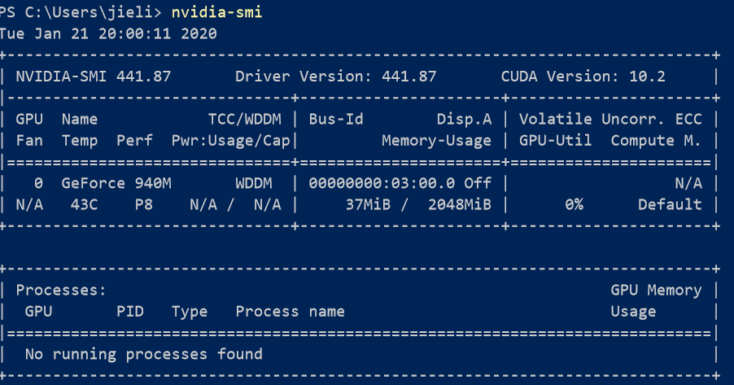
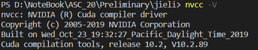
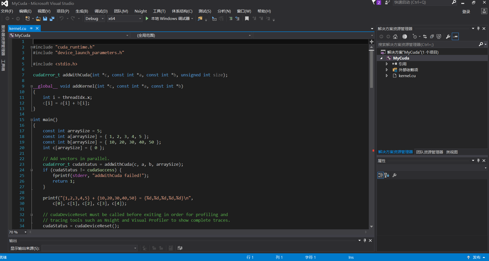
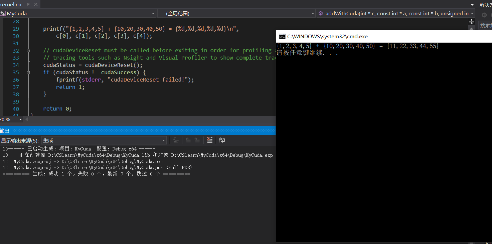
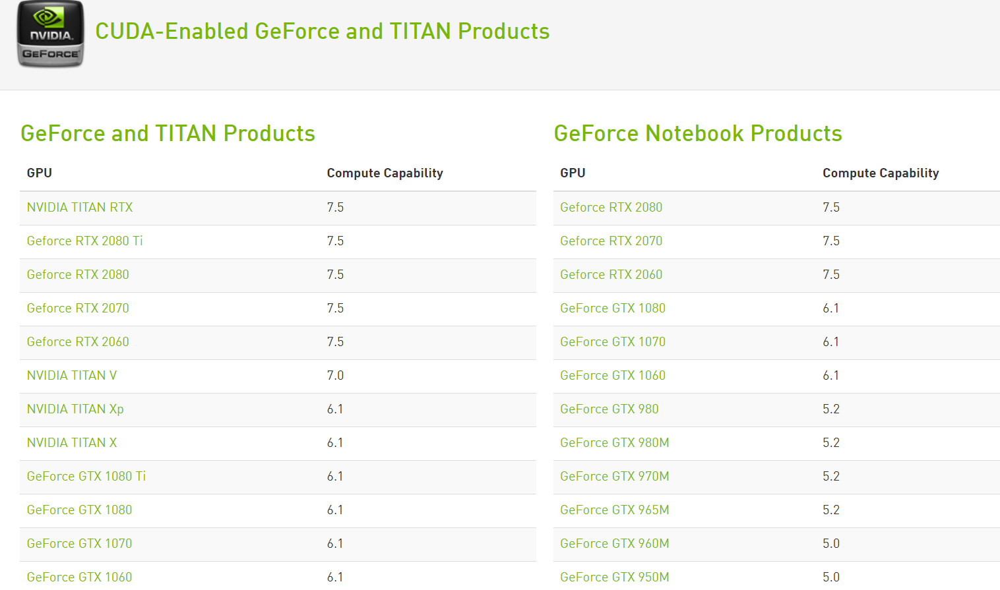
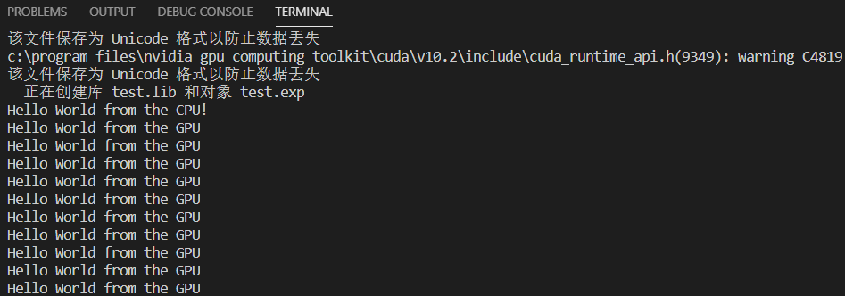
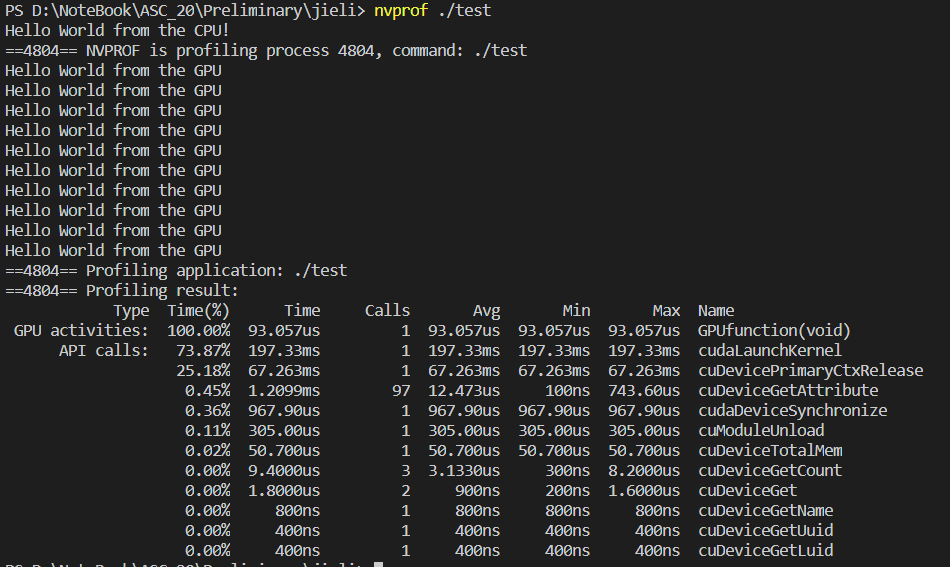
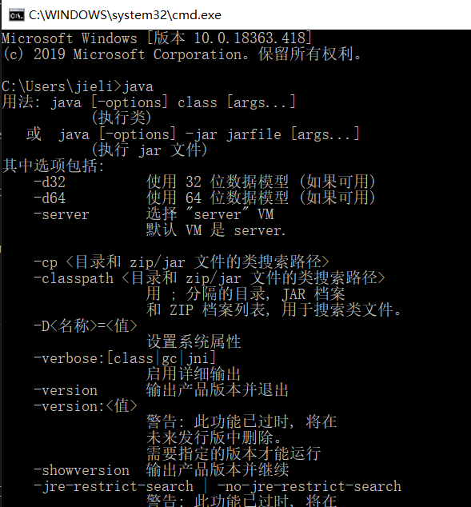

# Cuda安装与使用 ver_win10 #

## 下载nvidia驱动 ##  

如果电脑有显卡，win10系统安装后会自带nvidia驱动，通过打开**显卡驱动控制面板**--> **帮助** --> **系统信息**可查询当前驱动版本  
一般MS自带显卡驱动版本低于最新版本，建议通过此[链接](https://www.nvidia.com/Download/index.aspx?lang=cn)更新显卡驱动版本。
建议升级到10.2版本。  

更新后，通过cmd输入以下命令查看  
*nvidia-smi*  
应该返回如下信息  

  
说明驱动已成功安装  

## 安装cuda ##

根据上图返回信息，可知需下载CUDA 10.2。  
在该[链接](https://developer.nvidia.com/cuda-downloads)进行10.2下载  
## VS2015安装 ##

安装过程中需要VS201X的依赖 可从MS官网下载[社区版](https://visualstudio.microsoft.com/thank-you-downloading-visual-studio/?sku=Community&rel=16)或者使用以下注册码进行VS2015企业版安装  
``` shell
ed2k://|file|cn_visual_studio_enterprise_2015_with_update_3_x86_x64_dvd_8923298.iso|7787208704|A1C1D2AFBC09D8778C92CF19DEC8F4F4|/

密钥：HM6NR-QXX7C-DFW2Y-8B82K-WTYJV
```  
请一定装到非系统盘！！！
**特别说明**：安装VS2015是因为cu文件编译需要用到MS的Visual C++库(MS不提供单独下载 不是你有gcc就行...)，因此安装VS2015后请先建立cpp项目，此时VS2015会弹出更新框要求你安装升级组件，请务必勾选Visual C++下**所有**组件与SDK，否则你会在编译的时候遇到"cl.exe could not found"的报错(别问我怎么知道...) 

  

## 成功被VS2015吃掉10G后 ##
建议CUDA10.2安装使用Internet install  

成功安装后在cmd输入以下命令查看  
nvcc -V
理应返回  


## cu文件编译与运行 ##  

根据学习惯例，演示HelloWorld的编译与运行  

在IDE或terminal(powershell)下都可以。个人推荐terminal
### VS2015IDE下 ###
**新建项目**--> **NVIDIA** -->**CUDA 10.2**  
键入你的项目名称  
进入如下界面  
  
项目已经为你准备好kernel.cu的测试文件，让我们一起运行一下吧！  
kernel.cu文件的部分代码将运行在设备上(GPU),但主体依然是CPU，后面会有详细的说明。  
如果你注意观察addWithCuda这个函数 你会发现该行(90-91)  

```c
// Launch a kernel on the GPU with one thread for each element.
    addKernel<<<1, size>>>(dev_c, dev_a, dev_b);
```  

这表明在GPU上开单线程块并行运行size个线程，该操作与CPU操作是异步的。  

在工具栏  
**生成**-->**编译**  
编译无报错后 运行  
Note:你可能会遇到C4819的警告，推测是文件应保存为unicode，在**文件** --> **高级保存选项** 可进行修改。(但我改过也没用 警告并不影响编译)
**调试**--> **开始执行(不调试)**  
如果一切顺利 你会在cmd窗口中看到  
  
恭喜你！已完成在GPU运行上的第一个程序！  

### terminal ###  

win10下常见的terminal有cmd 、powershell、windows terminal(MS store)。推荐后两种啦，有高亮看着舒服点。  
插播:可以尝试下oh-my-posh 听说菜鸟程序员就喜欢折腾终端美化(是我本人没错了)   

这里代码编写的思路和linux下很像，在vim中编辑好 test.cu 文件，然后nvcc编译运行。win10下建议用vscode写cu文件，然后直接在vscode的终端中编译运行。  

请将以下代码保存为 test.cu。  

``` c
#include "cuda_runtime.h"
#include "device_launch_parameters.h"

#include <stdio.h>

void CPUfunction()
{
    printf("Hello World from the CPU!\n");
}

__global__ void GPUfunction()
{
    printf("Hello World from the GPU\n");
}

int main()
{
    CPUfunction();


    GPUfunction<<<2,5>>>();
    cudaDeviceSynchronize();
}
```  

在同文件下打开终端执行以下指令
``` shell  
nvcc -arch=sm_50 -o test test.cu -run  
```  
编译选项介绍  nvcc为cuda的编译器(同gcc为c的编译器) -arch指定计算架构，由于我是GeForce940M对应的是Maxwell架构，算力5.0因此arch对应为sm_50 根据个人显卡参数进行sm_xx的选择  
请务必参考该[链接](https://developer.nvidia.com/cuda-gpus)  
对应该表进行查询  
  

其他选项应该很熟悉 -o test test.cu 编译test.cu并指定输出文件名为test。-run运行  

如果一切顺利，你会得到以下输出  
  
一共有10个Hello GPU 本程序在GPU上开启两个线程块，每个线程块有5个线程，并行运行。所以有10次Hello GPU。  

恭喜你已经在终端下成功运行第一个GPU程序！接下来我们尝试下编译优化工具nvprof~  

相比于图形化界面，我更喜欢终端输出。nvprof有图形界面，我主要介绍它的字符界面  

编译test.cu生成输出为test 对test进行性能分析  
  
从这张图中我们可以看到GPU activities以及对应的GPUfunction 说明Hello World确实是从设备输出的(真没骗你)  

不过直接在终端运行nvprof是不可以的。需要进行一些配置  
1.安装jdk jre环境并配置环境变量  
   这步请自行百度 配置成功后在cmd测试  
     
2.将nvprof所在bin目录及相关配置到系统PATH变量  
C:\Program Files\NVIDIA GPU Computing Toolkit\CUDA\v10.2\bin 
C:\Program Files\NVIDIA GPU Computing Toolkit\CUDA\v10.2\libnvvp  
3.此时运行nvprof 你可能还会遇到以下报错  
nvprof -- cupti64_102.dll not found  
解决方案 从C:\Program Files\NVIDIA GPU Computing Toolkit\CUDA\v10.2\extras\CUPTI\lib64找到该文件复制到C:\Program Files\NVIDIA GPU Computing Toolkit\CUDA\v10.2\bin  
或者 将extras配置到PATH环境变量  

此时 在终端输入 nvprof -help你将得到一串选项介绍输出~  
恭喜你已经成功运行nvprof~

*待解决疑难杂症*  
在进行并行编程时，当我想要启动kenerl<<<1024,256>>>时，编译无误后运行会得到以下报错  
unspecified launch failure   
exe程序强制退出  
根据官方解答，此问题通常是段错误。但我在linux平台运行完全可以启动  
查阅到一个解答如下  
*代码没问题，问题出在windows*
*解决办法：window登录管理员用户，打开NSIGHT ，设置option的Microsoft display driver 的WDDM TDR enable为False即可，因为该选项导致kernel运行时间超过指定值会中断。*  
但我没有在VS2015的NSIGHT里找到对应选项...所以按上述方法配置在遇到高并行kernel会错误退出。如果有解决方案也欢迎告诉我~  

